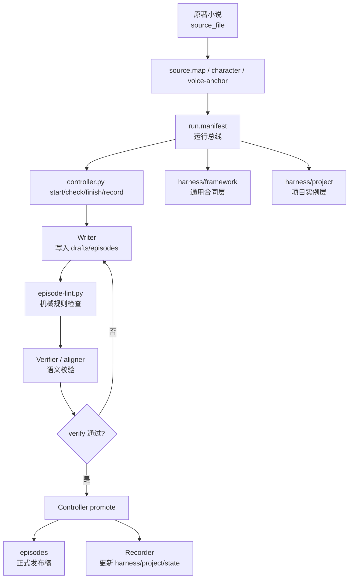
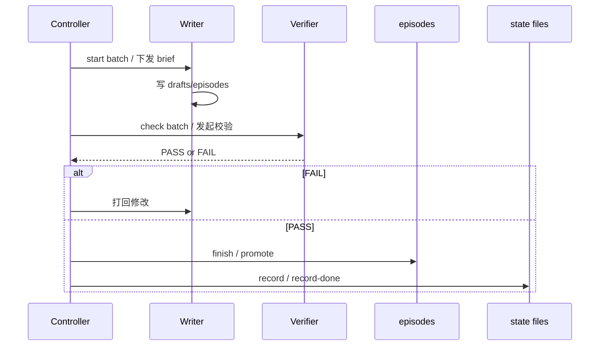

# Juben

面向“小说改编短剧剧本”的专用 Agent/Harness 项目。

这个仓库的核心不是通用聊天 Agent，而是一套带严格门控的内容生产流水线：读取小说与映射配置，按批次生成短剧草稿，经过 lint 和语义校验后，再由 controller 发布正式剧本并更新项目状态。

## 仓库定位

- 领域：小说 `->` 短剧剧本改编
- 运行方式：`Harness V2`
- 核心模式：`Controller + Writer + Verifier` 三角色分离
- 当前项目：`墨凰谋：庶女上位录`，共 60 集，每批 5 集

## 整体架构

## 简版时序图

这张图可以把项目先理解成一句话：
`Controller` 编排批次，`Writer` 写草稿，`Verifier` 决定是否通过，只有通过后才能进入正式 `episodes` 并更新 `state`。

## 关键目录

- [`G:\Juben\juben`](G:\Juben\juben)：主项目目录，绝大部分运行时文件都在这里
- [`G:\Juben\juben\harness\framework`](G:\Juben\juben\harness\framework)：通用运行规则与 contract
- [`G:\Juben\juben\harness\project`](G:\Juben\juben\harness\project)：当前小说项目的 manifest、state、brief、locks
- [`G:\Juben\juben\_ops`](G:\Juben\juben\_ops)：控制器、lint、测试与运维脚本
- [`G:\Juben\juben\episodes`](G:\Juben\juben\episodes)：已发布正式剧本
- [`G:\Juben\juben\harness\project\state`](G:\Juben\juben\harness\project\state)：故事状态、关系版、开放回环、流程记忆

## 运行主线

1. `controller.py start <batch>` 生成并冻结批次 brief。
2. Writer 只允许把候选稿写到 `drafts/episodes/`。
3. `episode-lint.py` 先做硬性计数校验。
4. Verifier/aligner 再做语义和风格校验。
5. `controller.py finish <batch>` 统一 promote 到 `episodes/`。
6. `controller.py record <batch>` / `record-done <batch>` 更新状态文件。

## 适合怎么理解它

如果你把“标准 agent”理解为一个能自由决定目标、自由调用工具、处理任意任务的自治系统，这个项目并不是那种形态。

它更像一个“面向剧本生产的专用 agent 操作系统”：

- 目标是固定的：改编短剧
- 流程是固定的：写作、校验、发布、记录
- 通道是固定的：draft lane 和 publish lane 严格分离
- 决策边界是固定的：是否通过、是否 promote、是否更新 state 都有 gate

## 从哪里继续看

- 快速理解项目：[`G:\Juben\juben\README.md`](G:\Juben\juben\README.md)
- 看运行入口：[`G:\Juben\juben\harness\framework\entry.md`](G:\Juben\juben\harness\framework\entry.md)
- 看当前项目配置：[`G:\Juben\juben\harness\project\run.manifest.md`](G:\Juben\juben\harness\project\run.manifest.md)
- 看控制器实现：[`G:\Juben\juben\_ops\controller.py`](G:\Juben\juben\_ops\controller.py)
