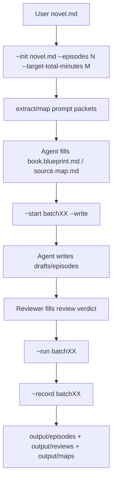

# Juben 部署与交付方案

## Overview

当前工程已经证明可以稳定产出可发布草稿。下一步不应急着做 SaaS 或让 Python 重新调用模型 CLI，而是先把它产品化成一个可复制、可初始化、可交接给其他 agent 使用的本地工具包。

推荐路线：

- V1：内部可用的 agent-native local pack
- V2：更干净的跨项目 CLI / 模板包
- V3：多人协作或 Web/API 服务化

V1 的目标是让一个同事拿到仓库后，只需要放入小说、运行初始化命令、按生成的 prompt packet 交给自己的 agent，就能跑完整个流程，并且清楚在哪里看输出。

## Problem Frame

当前工程能跑，但部署给别人会遇到四类问题：

- 入口仍偏工程内部：`controller.py` 有完整能力，但普通使用者不该理解所有子命令。
- 项目态和框架态混在同一个 `juben/` 目录里：当前小说、输出、状态、模板、脚本共存。
- 模型执行依赖 agent 环境：这是当前架构的优势，但必须明确写成使用契约，而不是假装它是全自动 CLI。
- 输出虽然已集中到 `output/`，但交付给别人时还需要一个“成品包”概念，包括剧本、brief、review、状态摘要和运行日志。

## Requirements Trace

- R1. 使用者可以从一份小说 Markdown 初始化项目，并指定集数或目标总时长。
- R2. 使用者不需要理解内部状态目录，也能知道下一步该做什么。
- R3. 保持 agent-native 执行边界：Python 只生成 prompt packet、编排状态、导出结果，不直接调用模型 CLI。
- R4. 输出路径稳定、可打包、可交付。
- R5. 框架模板和单个项目运行产物分离，避免把测试小说、草稿、状态一并分发给别人。
- R6. 支持不同 agent 或模型使用同一套 prompt packet，而不是绑定 Codex。
- R7. 部署包在 Windows 上优先好用，同时不阻断后续跨平台 CLI 化。

## Scope Boundaries

- V1 不做 Web UI。
- V1 不做 Python 调模型 API 或 CLI。
- V1 不做多人并发协作。
- V1 不做云端存储、账号、权限系统。
- V1 不隐藏 agent 审稿责任；reviewer 仍由 agent 或人执行。

## Context & Research

### Relevant Code and Patterns

- `juben/_ops/controller.py` 是主编排入口，已经包含 `init / extract-book / map-book / start / batch-review-done / run / record / status / export / clean`。
- `juben/_ops/run_book_extract.py`、`juben/_ops/run_book_map.py`、`juben/_ops/run_writer.py` 都支持 prompt packet 模式，不直接执行模型。
- `juben/harness/framework/*.md` 是框架级契约、prompt 模板和 review 标准。
- `juben/harness/project/*` 是当前项目运行态，不应作为干净模板直接发给别人。
- `juben/output/` 已经是人类可读输出镜像，适合成为交付主目录。
- `juben/~init.cmd`、`juben/~start.cmd`、`juben/~run.cmd`、`juben/~record.cmd`、`juben/~clean.cmd` 已经提供 Windows 包装入口。

### Local Constraints

- Python 依赖基本都是标准库，不需要复杂安装。
- 当前 README 在 PowerShell 输出中出现编码污染迹象，部署前需要统一 UTF-8 文档和终端说明。
- 当前仓库包含示例小说和已生成的 EP-01 到 EP-20，这些对开发验证有价值，但不适合作为默认分发态。

## Key Technical Decisions

- 先部署为本地工具包，不做 SaaS：当前核心质量来自 agent 执行 prompt packet，服务化会重新引入模型执行、超时、日志和成本控制问题。
- 框架和项目分离：框架目录保持可复用，项目目录由 `init` 生成，当前运行产物迁入 `examples/` 或从发布包排除。
- 输出优先于内部状态：使用者默认只看 `output/episodes`、`output/reviews`、`output/maps`、`output/state`。
- Agent-neutral prompt handoff：生成的 prompt packet 应避免 Codex 专属措辞，明确“任何具备文件读写能力的 agent 都可执行”。
- Windows V1，跨平台 V2：先保留 `.cmd`，同时设计未来 `python -m juben` 或 `juben` CLI 的路径。

## Open Questions

### Resolved During Planning

- 是否部署成 Web 服务：V1 不做，原因是当前架构已明确去掉 Python 调模型执行，Web 服务会把不稳定点重新引入。
- 是否要求用户安装额外 Python 包：暂不需要，当前 `_ops` 基本只用标准库。
- 是否绑定 Codex：不绑定，部署文档只要求“能读写工作区文件的 agent”。

### Deferred to Implementation

- 是否把当前示例运行结果保留在发布包里：实现时决定是放入 `examples/` 还是只放 release artifact。
- 是否增加真正跨平台 shell：V1 可先 Windows，V2 再补 `.sh` 或 Python console entry。
- 是否需要 zip 打包命令：实现时根据目标使用者习惯决定。

## Recommended Deployment Shape

This illustrates the intended approach and is directional guidance for review, not implementation specification.

## Implementation Units

- [ ] **Unit 1: 分离框架包和项目运行态**

**Goal:** 让仓库可以作为干净工具包分发，不把当前测试小说、草稿、运行状态默认带给使用者。

**Requirements:** R4, R5

**Dependencies:** None

**Files:**
- Modify: `juben/harness/project`
- Modify: `juben/drafts`
- Modify: `juben/episodes`
- Modify: `juben/output`
- Modify: `.gitignore`
- Test: `juben/_ops/test_controller_cli.py`

**Approach:**
- 明确哪些目录是 framework，哪些目录是 project runtime。
- 当前演示小说和输出可以迁入 `examples/`，或在 release 打包时排除。
- `init --force` 后应能重建干净项目态。
- `.gitignore` 应排除默认运行产物，但允许保留框架模板和示例。

**Patterns to follow:**
- 现有 `controller.py clean/init/export` 的项目态清理和导出逻辑。

**Test scenarios:**
- Happy path：干净 checkout 后运行 init，生成 `harness/project/run.manifest.md`、`book.blueprint.md`、`source.map.md` 占位文件。
- Edge case：已有旧项目态时运行 init --force，旧产物被备份或清理，框架模板不被删除。
- Integration：初始化后 `status` 能显示新项目 active，且 locks 为 free。

**Verification:**
- 发布包里默认不会混入某本小说的实际生产结果，除非位于 `examples/`。

- [ ] **Unit 2: 设计面向使用者的命令入口**

**Goal:** 普通使用者通过少量命令完成流程，不直接操作内部 controller 子命令。

**Requirements:** R1, R2, R7

**Dependencies:** Unit 1

**Files:**
- Modify: `~init.cmd`
- Modify: `juben/~init.cmd`
- Modify: `juben/~start.cmd`
- Modify: `juben/~run.cmd`
- Modify: `juben/~record.cmd`
- Create: `juben/~next.cmd`
- Create: `juben/~review.cmd`
- Test: `juben/_ops/test_controller_cli.py`

**Approach:**
- 保留当前 `.cmd` 包装层，补齐 `~next` 和 `~review`。
- `~next` 聚合 `status` 和下一步提示，降低用户理解成本。
- `~review batchXX PASS|FAIL` 包装 `batch-review-done`，减少命令长度。
- 错误信息面向用户，不暴露过多内部路径。

**Patterns to follow:**
- `juben/~init.cmd`
- `juben/_ops/controller-wrapper.cmd`

**Test scenarios:**
- Happy path：`~init "novel.md" --episodes 25 --target-total-minutes 50` 正确转发参数。
- Happy path：`~review batch01 PASS --reviewer codex` 正确写入 review verdict。
- Error path：缺少小说文件时，`~init` 输出明确用法。
- Error path：锁存在时，`~next` 提示先处理锁，而不是继续运行。

**Verification:**
- README 可以只列包装命令，不需要用户学习所有 controller 子命令。

- [x] **Unit 3: 建立标准 agent handoff 协议**

**Goal:** 让 Codex、Claude、Qwen 或其他 agent 都能按同一方式执行 prompt packet。

**Requirements:** R3, R6

**Dependencies:** Unit 2

**Files:**
- Modify: `juben/harness/framework/entry.md`
- Modify: `juben/harness/framework/extract-book-prompt.template.md`
- Modify: `juben/harness/framework/map-book-prompt.template.md`
- Modify: `juben/harness/framework/writer-batch-prompt.template.md`
- Modify: `juben/harness/framework/reviewer-prompt.template.md`
- Create: `juben/AGENT-RUNBOOK.md`
- Create: `juben/harness/framework/prompt-packet-protocol.md`
- Test: `juben/_ops/test_run_book_extract.py`
- Test: `juben/_ops/test_run_book_map.py`
- Test: `juben/_ops/test_run_writer.py`

**Approach:**
- 明确 agent 的通用能力要求：读取文件、写入指定文件、遵守 prompt packet、不要越权修改状态。
- prompt packet 中保留目标文件、禁止修改范围、完成后停止。
- 避免写“Codex 专属”或“Claude 专属”措辞。
- `AGENT-RUNBOOK.md` 提供不同 agent 的执行说明。

**Patterns to follow:**
- 当前 `writer-batch-prompt.template.md` 的目标文件和硬约束块。
- 当前 `reviewer-prompt.template.md` 的 review 输出契约。

**Test scenarios:**
- Happy path：writer prompt 包含目标文件、只写 drafts、禁止 promote/state 修改。
- Happy path：review prompt 包含 review standard、输出 JSON/MD 路径、PASS/FAIL 命令。
- Edge case：当 prompt packet 只生成不执行时，controller 输出下一步人类可读提示。

**Verification:**
- 使用者可以复制 prompt packet 给任何 agent，agent 不需要理解 controller 内部实现。

- [x] **Unit 4: 输出交付包标准化**

**Goal:** 让别人一眼知道最终成果在哪里，能直接交付剧本或复盘质量。

**Requirements:** R2, R4

**Dependencies:** Unit 1

**Files:**
- Modify: `juben/_ops/controller.py`
- Modify: `juben/output/README.md`
- Create: `juben/output/manifest.json`
- Create: `juben/output/SUMMARY.md`
- Test: `juben/_ops/test_controller_cli.py`

**Approach:**
- `export` 不只镜像文件，还生成一个人类可读 `SUMMARY.md`。
- `manifest.json` 记录小说名、目标总时长、集数、已完成 batch、输出目录、review verdict。
- `output/README.md` 明确哪些文件给编剧看、哪些给制片看、哪些给工程排错。
- 可选增加 `output/package/` 或 zip 产物，但不作为 V1 必须项。

**Patterns to follow:**
- 当前 `controller.py export` 对 output 镜像的处理。

**Test scenarios:**
- Happy path：完成 batch 后 `output/episodes`、`output/reviews`、`output/maps`、`output/state` 同步更新。
- Happy path：`manifest.json` 包含 `total_episodes`、`target_total_minutes`、`completed_episodes`。
- Edge case：未完成全部 batch 时，`SUMMARY.md` 标明当前只完成部分剧集。

**Verification:**
- 使用者不需要进入 `harness/project` 就能找到成品和当前进度。

- [x] **Unit 5: 中文部署文档与快速上手**

**Goal:** 降低交接成本，让同事按文档能跑通第一部小说。

**Requirements:** R1, R2, R6, R7

**Dependencies:** Unit 2, Unit 3, Unit 4

**Files:**
- Modify: `README.md`
- Modify: `juben/README.md`
- Create: `docs/deployment/local-agent-pack-v1.md`
- Create: `docs/deployment/operator-guide.md`
- Create: `docs/deployment/troubleshooting.md`
- Test expectation: none -- documentation-only unit

**Approach:**
- 所有文档统一 UTF-8。
- 首页只保留三件事：安装要求、五步跑通、输出在哪里。
- `operator-guide.md` 写给非工程使用者。
- `local-agent-pack.md` 写给部署者，说明如何复制模板和清理示例。
- `troubleshooting.md` 记录常见问题：编码、锁、prompt packet 未执行、review 未封板、输出没刷新。

**Patterns to follow:**
- 当前 `juben/harness/framework/entry.md` 的流程说明。

**Test scenarios:**
- Test expectation: none -- 文档不改变运行行为。

**Verification:**
- 新使用者按文档能理解：初始化、生成 prompt、让 agent 写文件、review、发布、查看 output。

- [ ] **Unit 6: V2 CLI 化预留**

**Goal:** 为后续跨平台部署和更正式的发行包预留路径，不阻塞 V1。

**Requirements:** R7

**Dependencies:** Unit 2

**Files:**
- Create: `juben/__main__.py`
- Create: `pyproject.toml`
- Modify: `juben/_ops/controller.py`
- Test: `juben/_ops/test_controller_cli.py`

**Approach:**
- V2 可提供 `python -m juben ...` 或 console script `juben ...`。
- 先复用 controller，不重写业务逻辑。
- `.cmd` 继续保留，CLI 化只是跨平台入口。

**Patterns to follow:**
- 当前 `controller.py` argparse 子命令。

**Test scenarios:**
- Happy path：`python -m juben status` 等价于 `python juben/_ops/controller.py status`。
- Happy path：`python -m juben init novel.md --episodes 25` 能初始化项目。
- Error path：未知子命令给出清晰帮助。

**Verification:**
- Windows 用户仍可用 `.cmd`，其他平台用户有 Python CLI 路径。

## Deployment Phases

### Phase 1: Internal Local Pack

- 清理项目态和示例产物。
- 固化包装命令。
- 补齐 agent runbook 和 output summary。
- 目标用户：你和同事，使用自己的 agent 环境。

### Phase 2: Reusable CLI Package

- 增加 `python -m juben` 或 console script。
- 增加 release zip 或 repo template。
- 支持跨平台 shell。
- 目标用户：会安装 Python、能使用 agent 的外部合作者。

### Phase 3: Hosted Orchestrator

- Web UI 只负责任务、文件、状态和 prompt packet 管理。
- 模型执行仍可先保持 agent handoff。
- 若未来要接 API，再单独设计模型队列、成本、超时、重试和审稿机制。
- 目标用户：非技术运营和多人协作团队。

## Risks & Mitigation

| Risk | Mitigation |
|------|------------|
| 使用者以为这是全自动工具 | 文档明确“Python 编排，agent 写稿/审稿” |
| 当前项目产物污染新项目 | 分离 framework/runtime，发布包排除运行态 |
| 不同 agent 执行 prompt 习惯不同 | 建立 agent-neutral runbook 和 prompt hard constraints |
| 输出难找 | `output/SUMMARY.md` + `output/manifest.json` + README 指向 |
| Windows 编码问题 | 文档统一 UTF-8，包装脚本避免打印大量中文诊断 |
| 过早服务化导致不稳定 | V1/V2 坚持本地 agent-native，V3 再评估 Web/API |

## Success Criteria

- 新同事在干净目录中 10 分钟内完成初始化并生成第一批 prompt packet。
- 新同事能按 runbook 让自己的 agent 写出 drafts。
- 完成一个 batch 后，用户只看 `output/` 就能找到剧本、review 和进度。
- 不需要 Python 调模型 CLI。
- 不需要手动阅读 `controller.py` 才能使用。

## Documentation / Operational Notes

- 部署文档必须用中文写，命令示例使用 Windows PowerShell / CMD 优先。
- 所有可编辑 prompt 模板继续放在 `juben/harness/framework`。
- 不把当前小说作为默认输入；如果要保留，放入 `examples/novels`。
- release 前建议跑一次干净目录初始化回归。

## Sources & References

- Related code: `juben/_ops/controller.py`
- Related code: `juben/_ops/run_book_extract.py`
- Related code: `juben/_ops/run_book_map.py`
- Related code: `juben/_ops/run_writer.py`
- Related wrappers: `juben/~init.cmd`
- Related wrappers: `juben/_ops/controller-wrapper.cmd`
- Framework docs: `juben/harness/framework/entry.md`
- Output mirror: `juben/output`
