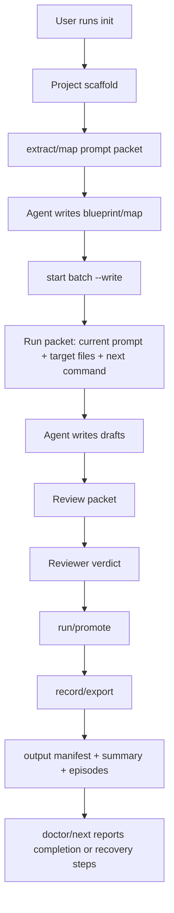

# Juben V3 产品化与可交付工作流计划

## Overview

V1/V2 已经证明核心链路可用：`python -m juben` 负责初始化、分集、生成 prompt packet、状态编排、review gate、promote、record、export；真正的写稿和审稿由外部 agent 执行。V3 的目标不是继续增加写作规则，而是把这套 agent-native 工作流产品化为可复制、可诊断、可交付、可替换模型的本地工具。

V3 的交付标准：一个新使用者拿到仓库后，能在不阅读 `controller.py` 的情况下，按引导完成一部小说的 25 集或自定义集数改编，并且清楚知道失败时该看哪里、下一步该做什么、最终成品在哪里。

## Problem Frame

当前 baseline 已经跑完整 25 集，但仍有几个产品化短板：

- 输出、运行态、框架态仍共同存在于 `juben/`，对新用户来说信息密度过高。
- prompt packet 虽然 agent-neutral，但用户还需要知道“把哪个 prompt 给 agent 执行、写回哪些文件、执行完跑什么命令”。
- 失败恢复仍偏工程化：锁、缺草稿、review pending、source/map 错位等情况需要更明确的诊断和修复入口。
- 模型/agent 替换没有正式配置层，实际靠文档约定。
- 当前发布包没有“交付模式”：工程调试文件、运行态文件、成品剧本和用户文档需要进一步分层。
- 质量验收依赖人工阅读和 reviewer prompt，但缺少一份生成完成后的总报告。

## Requirements Trace

- R1. 用户能通过一个清晰入口初始化小说项目，指定目标集数或总时长。
- R2. 用户能通过一个“下一步”命令知道当前状态、待执行 prompt、目标文件和下一条命令。
- R3. 工程继续保持 agent-native：Python 不调用模型 CLI/API，不重新引入超时和编码风险。
- R4. 成品输出目录必须面向用户，而不是面向开发者。
- R5. 支持 Codex、Claude、Qwen、Gemini 或其他可读写文件的 agent 执行同一套 prompt packet。
- R6. 每个失败状态都有明确诊断、恢复建议和不会破坏数据的安全命令。
- R7. 完整生产结束后生成一份总报告，说明集数、字数、review verdict、风险 warning 和输出位置。
- R8. V3 不改变核心写作质量规则，除非发现会影响工作流稳定性的结构问题。

## Scope Boundaries

- 不做 Web UI。
- 不做 Python 直接调用模型。
- 不做多用户并发协作。
- 不做云端账号、权限、计费。
- 不重写大规模写作 prompt，只做必要的 handoff、配置、输出和诊断层。
- 不把本轮 25 集内容当成模板逻辑，只作为 example baseline。

## Context & Research

### Relevant Code and Patterns

- `juben/_ops/controller.py` 已包含主要编排命令：`init`、`extract-book`、`map-book`、`start`、`batch-review-done`、`run`、`record`、`status`、`next`、`clean`、`export`。
- `juben/_ops/run_book_extract.py`、`juben/_ops/run_book_map.py`、`juben/_ops/run_writer.py` 已生成 prompt packet，不直接调用模型。
- `juben/harness/framework/prompt-packet-protocol.md` 是 agent handoff 的关键协议。
- `juben/harness/framework/reviewer-prompt.template.md` 和 `juben/harness/framework/review-standard.md` 已把审稿口径外置。
- `juben/output/` 已经是成品镜像，但还需要更强的交付报告和目录说明。
- `juben/output/manifest.json` 已存在，可扩展为 V3 的总入口。
- `docs/plans/2026-04-24-001-feat-juben-deployment-plan.md` 已完成 V1/V2 方向的大部分基础建设。

### Institutional Learnings

- Python 调模型 CLI 是最大不稳定源，V3 必须继续避免。
- 规则后置 lint/patch 会拖慢并污染质量判断，V3 不恢复旧 lint/patch。
- 分集和 writer 的主要职责边界应保持：上游给上下文和边界，agent 负责生成和审稿。
- source excerpt 可能和 source.map 编排错位，V3 要把“权威输入优先级”和错位诊断显式化。

### External References

- External research not needed for V3. This is a local workflow/productization effort with strong repo-local patterns and no external API/security/payment dependency.

## Key Technical Decisions

- **继续本地 agent-native，不做模型执行器**：保持当前稳定性，避免重新引入超时、日志污染和编码问题。
- **用 `output/` 作为用户主视图**：用户默认只看 `output/README.md`、`output/SUMMARY.md`、`output/manifest.json`、`output/episodes/`。
- **新增“run packet”概念而不是隐藏 prompt packet**：用户仍让 agent 执行 prompt，但系统应该清楚指出当前要执行哪份 prompt、目标文件是什么。
- **失败恢复做成诊断层，不做自动乱修**：V3 应提供 `doctor`/`next` 风格诊断，恢复动作必须保守，不删除用户产物。
- **模型替换通过文档和配置，不通过 Python adapter 调模型**：配置只描述推荐 agent、输出能力和注意事项，不执行模型。
- **把示例 baseline 与默认项目态分离**：完整 25 集作为 example 或 release artifact，不能污染新项目初始化。

## Open Questions

### Resolved During Planning

- 是否需要先继续优化写作质量：不作为 V3 主线。当前 baseline 已可用，V3 先解决部署和产品化。
- 是否要做 Web/API：不做，风险和工作量都不适合当前阶段。
- 是否恢复自动 lint/patch：不恢复，reviewer agent 是质量判断主路径。

### Deferred to Implementation

- 示例 baseline 放在 `examples/` 还是 release 包：实现时根据当前仓库体积和发布习惯决定。
- `doctor` 是独立命令还是 `next --doctor`：实现时根据 controller 参数结构决定。
- 是否需要 `juben/output/package/` 打包目录：先实现总报告和清晰输出，打包可作为后续增强。

## High-Level Technical Design

> This illustrates the intended approach and is directional guidance for review, not implementation specification. The implementing agent should treat it as context, not code to reproduce.

## Implementation Units

- [ ] **Unit 1: 用户主入口与下一步体验**

**Goal:** 让用户不阅读内部命令也知道当前该做什么。

**Requirements:** R1, R2, R6

**Dependencies:** None

**Files:**
- Modify: `juben/_ops/controller.py`
- Modify: `juben/~next.cmd`
- Modify: `juben/README.md`
- Test: `juben/_ops/test_controller_cli.py`

**Approach:**
- 强化 `next` 输出：当前阶段、待执行 prompt、目标文件、下一条命令、常见阻塞。
- 当 draft missing 时，明确显示 writer prompt packet 路径和 expected output。
- 当 review pending 时，明确显示 review prompt、review standard、封板命令。
- 当 locks 非空时，显示锁名、可能原因和安全处理建议。

**Patterns to follow:**
- `controller.py` 中现有 `status`、`next`、`start --write` 输出。

**Test scenarios:**
- Happy path: 新项目初始化后 `next` 指向 extract/map prompt packet。
- Happy path: batch started but drafts missing 时，`next` 指向 writer prompt 和目标 EP 文件。
- Happy path: drafts exist but review pending 时，`next` 指向 review prompt 和 `~review` 用法。
- Edge case: pipeline complete 时，`next` 显示 production complete 和 output 位置。
- Error path: batch lock 存在时，`next` 不建议继续 start，而是提示锁诊断。

**Verification:**
- 用户执行 `python -m juben next` 后，不需要翻 `harness/project` 就能知道下一步。

- [ ] **Unit 2: Run Packet 总览文件**

**Goal:** 每次生成 prompt packet 时，同时生成一份人类可读的“当前执行包说明”。

**Requirements:** R2, R5, R6

**Dependencies:** Unit 1

**Files:**
- Modify: `juben/_ops/controller.py`
- Create: `juben/harness/project/run-packet.md`
- Modify: `juben/output/_runtime/`
- Test: `juben/_ops/test_controller_cli.py`

**Approach:**
- `run-packet.md` 只包含当前阶段的最小执行信息：prompt 路径、agent 任务、允许写入文件、完成后命令。
- 每次 `extract-book`、`map-book`、`start --write`、`check` 生成或刷新该文件。
- `output/_runtime/run-packet.md` 同步导出，便于用户只看 output。
- 不复制完整 prompt，避免重复维护；只引用 prompt packet 路径。

**Patterns to follow:**
- `batch01.writer.batch.prompt.md` 的目标文件和硬约束块。
- `batchXX.review.prompt.md` 的输出契约。

**Test scenarios:**
- Happy path: map 阶段 `run-packet.md` 指向 `map-book.prompt.md` 和 `source.map.md`。
- Happy path: writer 阶段 `run-packet.md` 列出 EP 文件目标。
- Happy path: review 阶段 `run-packet.md` 列出 JSON/MD review 输出和封板命令。
- Integration: `export` 后 output runtime 中也能看到最新 run packet。

**Verification:**
- 用户可以把 `run-packet.md` 和对应 prompt 一起交给任意 agent。

- [ ] **Unit 3: Agent/模型替换配置与说明**

**Goal:** 正式支持不同 agent 执行同一工作流，不再靠口头说明。

**Requirements:** R3, R5

**Dependencies:** Unit 2

**Files:**
- Create: `juben/agent-profiles.example.md`
- Create: `juben/harness/project/agent.profile.md`
- Modify: `juben/harness/framework/prompt-packet-protocol.md`
- Modify: `juben/README.md`
- Test expectation: none -- documentation/config-only unit, unless controller reads the profile.

**Approach:**
- 提供 agent profile 示例：Codex、Claude、Qwen、Gemini、本地人工执行。
- profile 只记录执行建议和限制，不让 Python 调模型。
- prompt packet protocol 明确最低 agent 能力：读文件、写指定文件、遵守禁止范围、完成后停止。
- 明确不同 agent 的常见风险：自动解释不写文件、越权改状态、只输出总结、中文编码。

**Patterns to follow:**
- `juben/harness/framework/prompt-packet-protocol.md`
- `docs/plans/2026-04-24-001-feat-juben-deployment-plan.md` 的 agent-neutral handoff 决策。

**Test scenarios:**
- Test expectation: none -- 文档和示例配置不改变运行行为。

**Verification:**
- 新用户能按自己使用的 agent 找到执行注意事项。

- [ ] **Unit 4: 诊断与安全恢复命令**

**Goal:** 常见失败状态可诊断、可恢复，不需要用户懂内部目录。

**Requirements:** R2, R6

**Dependencies:** Unit 1

**Files:**
- Modify: `juben/_ops/controller.py`
- Create or Modify: `juben/~doctor.cmd`
- Modify: `juben/README.md`
- Create: `docs/deployment/troubleshooting.md`
- Test: `juben/_ops/test_controller_cli.py`

**Approach:**
- 增加 `doctor` 命令或扩展 `next --doctor`。
- 检查项包括：锁状态、manifest 完整性、source.map complete、batch brief 是否存在、draft/review/promote/record 状态一致性、output 是否同步。
- 诊断只报告和建议，不默认删除。
- 提供保守恢复建议：重跑 start、重建 review packet、record、export、unlock 指引。

**Patterns to follow:**
- `controller.py status`
- `controller.py validate`
- `controller.py clean`

**Test scenarios:**
- Happy path: 完整 pipeline 返回 all clear。
- Error path: draft missing 返回 writer prompt 路径和目标文件。
- Error path: review pending 返回 review prompt 和封板命令。
- Error path: stale lock 返回锁文件和安全处理建议。
- Error path: output 缺文件但 episodes 存在，建议 `export`。

**Verification:**
- 用户遇到中断时先跑 `doctor`，能知道最小恢复动作。

- [ ] **Unit 5: 输出交付报告升级**

**Goal:** 生产完成后自动生成可交付总报告，而不是只看文件列表。

**Requirements:** R4, R7

**Dependencies:** Unit 1

**Files:**
- Modify: `juben/_ops/controller.py`
- Modify: `juben/output/SUMMARY.md`
- Modify: `juben/output/manifest.json`
- Create: `juben/output/QUALITY.md`
- Test: `juben/_ops/test_controller_cli.py`

**Approach:**
- `SUMMARY.md` 包含项目参数、完成集数、总字数、每集字数/场次数、batch verdict。
- `QUALITY.md` 汇总每批 review reason、warning families、关键风险和人工复核建议。
- `manifest.json` 作为机器可读入口，记录 run status、completed batches、episode paths、review paths、timestamps。
- 完整完成后明确显示 production complete。

**Patterns to follow:**
- 现有 `output/manifest.json`
- 现有 `reviews/batchXX.review.json`

**Test scenarios:**
- Happy path: 完整 25 集后 summary 显示 25/25、5/5 batch done、总字数。
- Happy path: 部分完成时 summary 显示 pending batch。
- Integration: review warning families 能进入 `QUALITY.md`。
- Edge case: 某集文件缺失时 manifest 标记 incomplete。

**Verification:**
- `output/` 可以直接打包给同事或客户初审。

- [ ] **Unit 6: 示例 baseline 与模板运行态分离**

**Goal:** 保留当前完整 25 集 baseline 作为示例，同时保证新用户初始化时不被示例污染。

**Requirements:** R4, R8

**Dependencies:** Unit 5

**Files:**
- Create or Modify: `juben/examples/`
- Modify: `.gitignore`
- Modify: `juben/_ops/controller.py`
- Modify: `juben/README.md`
- Test: `juben/_ops/test_controller_cli.py`

**Approach:**
- 将完整 baseline 定义为 example artifact 或 release fixture。
- 新项目初始化默认写入 `harness/project`，不会读取 example runtime。
- 文档说明 example 仅用于参考质量和目录结构。
- `.gitignore` 需要区分“示例保留文件”和“用户本地运行产物”。

**Patterns to follow:**
- 当前 `juben/output/` 完整 baseline。
- `controller.py clean/init` 的 runtime 清理逻辑。

**Test scenarios:**
- Happy path: clean init 后不会复制 example episodes 到当前 project output。
- Happy path: example baseline 文件仍可被文档链接引用。
- Error path: 用户删除 runtime output 后，example 不受影响。

**Verification:**
- 仓库既能展示成功样例，又能作为干净模板使用。

- [ ] **Unit 7: 端到端验收脚本与人工验收清单**

**Goal:** V3 完成后可重复验证一条最小生产链路。

**Requirements:** R1, R2, R3, R6, R7

**Dependencies:** Unit 1, Unit 2, Unit 4, Unit 5

**Files:**
- Create: `docs/deployment/v3-acceptance-checklist.md`
- Modify: `juben/_ops/test_controller_cli.py`
- Modify: `juben/_ops/test_run_book_extract.py`
- Modify: `juben/_ops/test_run_book_map.py`
- Modify: `juben/_ops/test_run_writer.py`

**Approach:**
- Automated tests cover controller behavior and generated packet contracts.
- Manual checklist covers actual agent execution, because Python must not call models.
- Checklist includes clean init, extract/map prompt execution, batch01 writer, review PASS, run, record, output inspection.
- Include failure drills: missing drafts, pending review, stale lock, output stale.

**Patterns to follow:**
- Existing controller CLI tests.
- Existing prompt packet tests.

**Test scenarios:**
- Happy path: `python -m juben init ...` creates project files and `next` points to first action.
- Happy path: `start batch01 --write` creates writer prompt and run packet without model invocation.
- Error path: missing drafts does not promote.
- Error path: review pending blocks run.
- Integration: after mocked PASS, run + record updates output manifest and summary.

**Verification:**
- A future agent can run the checklist before declaring V3 complete.

## System-Wide Impact

- **Interaction graph:** `init/extract/map/start/check/review/run/record/export/next/status` outputs become more user-facing; tests must assert contracts, not exact incidental prose.
- **Error propagation:** diagnosis should report actionable states without throwing stack traces for normal incomplete workflow states.
- **State lifecycle risks:** run packet and output summaries must not become stale after record/export.
- **API surface parity:** `.cmd` wrappers and `python -m juben` should expose the same user-facing flow.
- **Integration coverage:** controller tests need partial-state scenarios, not just complete happy path.
- **Unchanged invariants:** Python still does not invoke model CLI/API; prompt packet remains the handoff boundary.

## Risks & Dependencies

| Risk | Mitigation |
|------|------------|
| V3 accidentally grows into a new orchestration engine | Keep scope to UX, diagnostics, output, docs; no model execution |
| Tests become brittle due to exact Chinese output matching | Assert key fields/paths/states rather than full output blocks |
| Example baseline pollutes new projects | Separate example artifacts from runtime and test clean init |
| Too many new commands confuse users | Prefer `next` and `doctor` as top-level guidance commands |
| Source excerpt错位再次误导写作 | Document authority priority and surface warnings when source excerpt/source.map mismatch |
| Output report duplicates too much data | Summary links to detailed files; manifest stores machine-readable index |

## Phased Delivery

### Phase 1: Guidance Layer

- Implement `next` improvements.
- Add `run-packet.md`.
- Add agent profile docs.

### Phase 2: Diagnostics Layer

- Add `doctor` or `next --doctor`.
- Add recovery messages and tests for common broken states.

### Phase 3: Output Delivery Layer

- Upgrade `SUMMARY.md`, `manifest.json`, and add `QUALITY.md`.
- Ensure export keeps output reports fresh.

### Phase 4: Baseline Packaging

- Separate example baseline from runtime.
- Finalize deployment docs and acceptance checklist.

## Success Metrics

- A new user can run `init` and identify the next required agent action from one command.
- Every generated prompt packet has a corresponding run packet.
- `doctor` identifies at least these states: clean, draft missing, review pending, stale lock, output stale, complete.
- `output/` alone contains enough information to review the finished product.
- V3 tests prove no Python-managed model process is introduced.
- The 25-episode baseline remains reproducible or preserved as an example.

## Documentation / Operational Notes

- Documentation should be Chinese-first.
- Command examples should prefer `python -m juben` and mention `.cmd` wrappers for Windows users.
- Troubleshooting should explicitly say PowerShell mojibake can be terminal display only if UTF-8 files read correctly.
- The V3 plan should be executed before any Web/API discussion.

## Sources & References

- Origin plan: `docs/plans/2026-04-24-001-feat-juben-deployment-plan.md`
- Related code: `juben/_ops/controller.py`
- Related code: `juben/_ops/run_book_extract.py`
- Related code: `juben/_ops/run_book_map.py`
- Related code: `juben/_ops/run_writer.py`
- Related protocol: `juben/harness/framework/prompt-packet-protocol.md`
- Related review: `juben/harness/framework/reviewer-prompt.template.md`
- Related review: `juben/harness/framework/review-standard.md`
- Output root: `juben/output`
