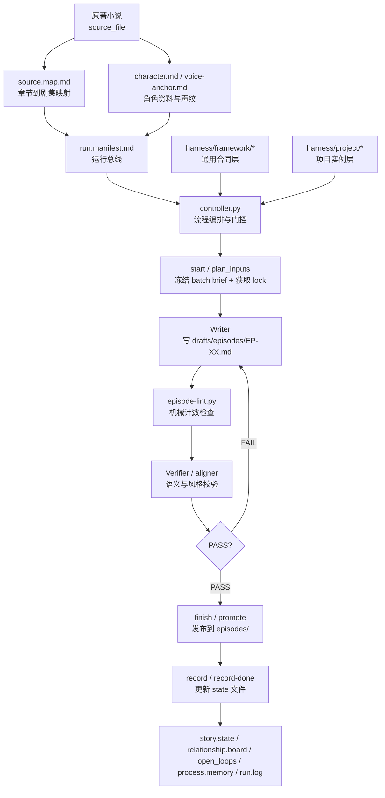
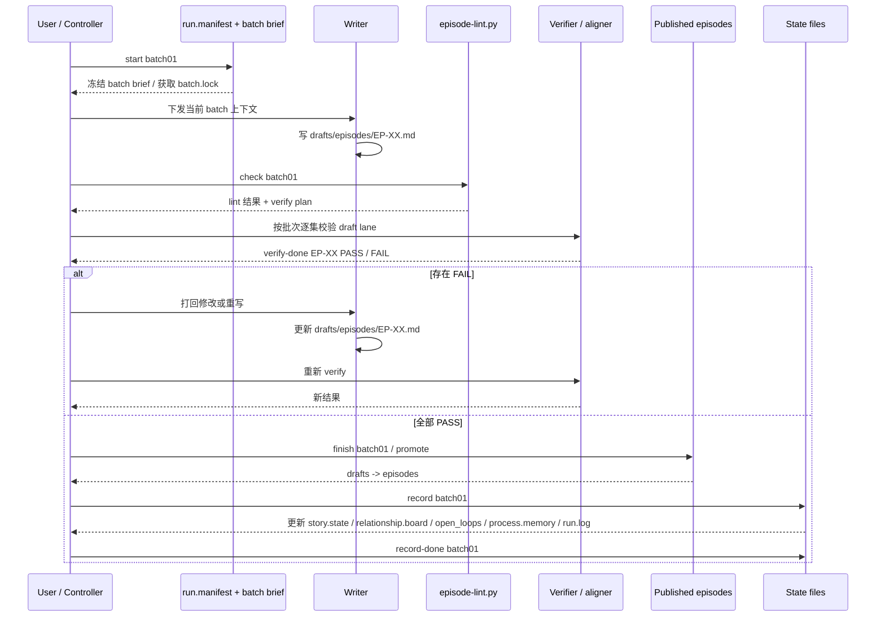

# JUBEN — 小说 → 短剧改编 Agent

通用的小说改编短剧 agent 框架。使用 `Harness V2` 管理：剧本生成 → 语义校验 → 发布 → 状态记录。

## 快速开始

```bash
# 1. 初始化新项目（换小说只需这一步）
python _ops/controller.py init 新小说.md --episodes 40 --key-episodes "EP-15, EP-30, EP-40"

# 2. 填写 source.map.md（章节到剧集的映射）
# 3. 填写 character.md 和 voice-anchor.md

# 4. 开始第一个批次
python _ops/controller.py start batch01
```

## 当前状态

- 运行时总线：`harness/project/run.manifest.md`（包含当前小说、集数、策略等）
- 正式剧本输出：`episodes/`
- 草稿通道：`drafts/episodes/`
- 框架层（通用）：`harness/framework/`
- 项目层（当前小说）：`harness/project/`

## 整体架构图



### 读图说明

- `controller.py` 是唯一门控中心，负责冻结批次、推进 phase、发布正式稿和落状态。
- `Writer` 只能写候选草稿，不能直接发布。
- `Verifier` 只读 draft lane，不改稿，只给 `PASS / FAIL`。
- `framework` 放通用规则，`project` 放当前小说的实例化配置和运行状态。
- `episodes/` 是发布结果，不是当前写作输入。

## 一句话理解 Harness V2

它不是开放式的通用 Agent，而是一个围绕“短剧改编生产线”设计的专用 harness：

- 用 `run.manifest.md` 管理当前运行实例
- 用 `batch brief + locks` 管理批次推进
- 用 `draft lane / publish lane` 分离候选稿和正式稿
- 用 `lint + verify + promote + record` 保证内容进入正式区前经过门控

## 标准时序图



### 时序图怎么读

- `start` 阶段只做输入装配、冻结 brief 和加锁，不直接写正文。
- `check` 阶段先过 lint，再把草稿交给 verifier 做语义校验。
- `verify-done` 是 verifier 向 controller 回报结果的唯一入口。
- 只有整批通过后，`finish` 才能 promote 到 `episodes/`。
- `record` 永远发生在 promote 之后，只更新 `harness/project/state/*`。

## 项目结构

```text
juben/
├── AGENTS.md                  # 主入口，薄路由到 Harness V2
├── OPENAI.md                  # OpenAI 入口
├── CLAUDE.md                  # Claude 入口
├── 墨凰谋：庶女上位录.md       # 原著正文
├── outline.md                 # 剧集大纲
├── episode_index.md           # 集目录
├── character.md               # 人物资料
├── voice-anchor.md            # 角色声纹
├── episodes/                  # 已发布的正式剧本
├── drafts/episodes/           # 当前候选草稿
├── harness/
│   ├── framework/             # 通用 harness 合同层
│   ├── project/               # 本项目运行层
│   │   ├── run.manifest.md    # 唯一运行时总线
│   │   ├── source.map.md      # 原著章节到剧集映射
│   │   ├── batch-briefs/      # 批次 brief
│   │   ├── regressions/       # 项目级回归阻断清单
│   │   ├── locks/             # 运行时文件锁
│   │   └── state/             # 项目状态、质量锚、流程记忆
│   └── legacy/v1/             # 旧 v1 文件归档
├── _ops/
│   ├── controller.py          # 流水线控制器（门控 + 编排）
│   ├── episode-lint.py        # 机械计数检查
│   ├── script-aligner.md      # Verify adapter
│   ├── script-recorder.md     # Record adapter
│   ├── test_episode_lint.py   # lint/verify 合约测试
│   └── test_harness_v2.py     # Harness V2 结构测试
└── versions/
    ├── rebuild_snapshots/     # 历史快照
    └── changelog.md           # 版本记录
```

## Harness V2 的核心设计

### 1. 双层架构

- `harness/framework/`
  - 放通用运行时制度，不写小说专属剧情
  - 主要包括输入合同、写作合同、校验合同、发布合同、记忆合同、回归合同
- `harness/project/`
  - 放当前小说实例化后的运行时数据
  - 包括 run manifest、source map、batch brief、状态文件、回归清单和锁

### 2. 双通道输出

- `drafts/episodes/`
  - writer 只能写这里
  - verify 只读取这里
- `episodes/`
  - 这里只放 controller promote 后的正式稿
  - 不作为当前候选草稿的写作输入

### 3. 五阶段流程

1. `plan_inputs`（`start`）
   - 读取 `run.manifest.md` + `source.map.md`
   - 自动生成或冻结 `batch brief`
   - 获取 batch.lock
2. `draft_write`
   - writer 只写 `drafts/episodes/EP-XX.md`
3. `verify`（`check` → `verify-done`）
   - 先跑 `_ops/episode-lint.py`（硬门控）
   - 再按 `verify-contract.md` 做语义验证（对抗性检查、声纹、质量锚）
   - aligner 通过 `verify-done` 报告结果，controller 记录到 `locks/verify-EP-XX.json`
4. `promote`（`finish`）
   - lint gate + verify gate 双重门控
   - 只有 controller 才能把 draft 复制到 `episodes/`
5. `record`（`record` → `record-done`）
   - 获取 state.lock，recorder 更新 `harness/project/state/*` 全部 6 个文件
   - `record-done` 验证结构完整性后释放锁

## 关键文件说明

### 入口层

- [AGENTS.md](./AGENTS.md)
  - 主入口，只负责把运行路由导向 Harness V2
- [OPENAI.md](./OPENAI.md)
- [CLAUDE.md](./CLAUDE.md)

### 框架层

- [entry.md](./harness/framework/entry.md)
  - 定义 phases、路由和 fail-closed 规则
- [input-contract.md](./harness/framework/input-contract.md)
  - 定义 run manifest、source map、batch brief、locks、lane 结构
- [write-contract.md](./harness/framework/write-contract.md)
  - 定义写作边界、对白规则、`os` 规则、原著保真规则
- [verify-contract.md](./harness/framework/verify-contract.md)
  - 定义 FAIL / WARNING
- [promote-contract.md](./harness/framework/promote-contract.md)
  - 定义 `draft -> verify -> promote`
- [memory-contract.md](./harness/framework/memory-contract.md)
  - 区分 story memory 和 process memory
- [regression-contract.md](./harness/framework/regression-contract.md)
  - 定义项目回归阻断包结构

### 项目层

- [run.manifest.md](./harness/project/run.manifest.md)
  - 唯一运行时总线
- [source.map.md](./harness/project/source.map.md)
  - 原著章节映射
- [batch01_EP01-05.md](./harness/project/batch-briefs/batch01_EP01-05.md)
  - 当前批次 brief 样例
- [regressions/](./harness/project/regressions/)
  - 项目级回归目录；只有存在活跃回归时才新增具体 pack 文件
- [process.memory.md](./harness/project/state/process.memory.md)
  - 流程层问题与防复发规则

### 执行层

- [_ops/controller.py](./_ops/controller.py)
  - 流水线控制器，18 个子命令，所有 promote / verify / record 必须经过它
- [_ops/episode-lint.py](./_ops/episode-lint.py)
  - 机械计数器
- [_ops/script-aligner.md](./_ops/script-aligner.md)
  - verify adapter，只认 Harness V2 权威源
- [_ops/script-recorder.md](./_ops/script-recorder.md)
  - record adapter，只写 `harness/project/state/*`

## 当前运行约束

- writer 不允许直写 `episodes/`
- verify 不允许拿 published lane 当当前候选结果
- state 文件只能在 promote 后由 controller 更新
- legacy v1 文件只保留参考，不再是运行时权威

## Controller 命令

`_ops/controller.py` 是流水线的程序化门控，所有 promote、verify、record 都必须经过它。

### 项目初始化

| 命令 | 作用 |
|---|---|
| `init <novel_file>` | 一键搭建新项目：生成 manifest、source.map 模板、state 文件模板、清空旧输出 |

选项：`--episodes 40 --batch-size 5 --strategy original_fidelity --intensity light --key-episodes "EP-15, EP-30"`

**换小说时只需 `init` 一条命令**，然后填写 source.map 和 character/voice-anchor 即可。

### 编排命令（日常使用）

| 命令 | 作用 |
|---|---|
| `start <batch>` | 从 source.map 自动生成 batch brief → 冻结 → 获取 batch.lock → 打印 writer 上下文和 verify-plan |
| `check <batch>` | lint 全集 → verify-plan 分层 → 打印 aligner 执行指令和 `verify-done` 报告模板 |
| `finish <batch>` | lint gate → verify gate → promote → state validation → batch-review 抽样 |
| `next` | 展示已 promote / 待处理批次、锁状态、下一个该启动的 batch |

### 门控命令（verify / record）

| 命令 | 作用 |
|---|---|
| `verify-done <EP> <PASS\|FAIL> --tier <tier>` | 记录 aligner 语义验证结果，FAIL 时联动 retry 计数 + 升级提示 |
| `record <batch>` | 门控 batch 已 promoted → 获取 state.lock → 打印 recorder 指令 |
| `record-done <batch>` | 验证 6 个 state 文件结构完整 → 释放 state.lock → 写 run.log |

### 低层命令

| 命令 | 作用 |
|---|---|
| `status` | 展示流水线状态、锁、草稿、已发布集（含批次归属）、verify 结果 |
| `plan <batch>` | 冻结 batch brief + 获取 batch.lock |
| `lint <EP-XX>` | 对单集草稿跑 lint |
| `gate <batch>` | 检查批次内所有草稿是否通过 lint |
| `promote <batch>` | 复制 drafts → episodes（门控：lint + verify + state.lock） |
| `validate` | 检查 state 文件是否符合 memory-contract 模板 |
| `log <phase> <event>` | 向 run.log.md 追加条目 |
| `retry <EP-XX>` | 查看/递增 verify 重试计数 |
| `verify-plan <batch>` | 计算 verify 分层（FULL / STANDARD / LIGHT） |
| `batch-review <batch>` | 生成批次级 review 清单（对抗抽样） |
| `unlock <name>` | 释放锁（batch / episode / state / all） |

### 标准流水线

```text
# 换小说时（仅首次）
python _ops/controller.py init 新小说.md --episodes 40
# 然后填写 source.map.md、character.md、voice-anchor.md

python _ops/controller.py start batch01        # 1. 生成 brief、冻结、锁
  → writer 写稿到 drafts/episodes/
python _ops/controller.py check batch01        # 2. lint gate + verify 指令
  → aligner 逐集语义验证
python _ops/controller.py verify-done EP-01 PASS --tier FULL --batch batch01
python _ops/controller.py verify-done EP-02 PASS --tier STANDARD --batch batch01
  → ...（每集报告）
python _ops/controller.py finish batch01       # 3. verify gate + promote
python _ops/controller.py record batch01       # 4. 获取 state.lock
  → recorder 更新 state files
python _ops/controller.py record-done batch01  # 5. 验证 + 释放锁
python _ops/controller.py next                 # 6. → "start batch02"
```

## 常用验证

在项目根目录执行：

```powershell
python .\_ops\test_episode_lint.py
python .\_ops\test_harness_v2.py
```

检查某一集草稿：

```powershell
python .\_ops\episode-lint.py .\drafts\episodes\EP-01.md
```

## 旧结构说明

以下 root 文件已退出主运行面：

- `runtime-core.md`
- `adaptation-core.md`
- `project.profile.md`
- `script.progress.md`
- `story.state.md`
- `relationship.board.md`
- `open_loops.md`
- `quality.anchor.md`

它们的保留版本位于：

- [harness/legacy/v1](./harness/legacy/v1)

## 维护建议

- 新增规则时，优先改 `harness/framework/*`
- 新增项目实例化配置时，优先改 `harness/project/*`
- 新增人工审稿问题时，优先在 `harness/project/regressions/` 下新建回归 pack
- 不要再把新的运行时权威塞回根目录
