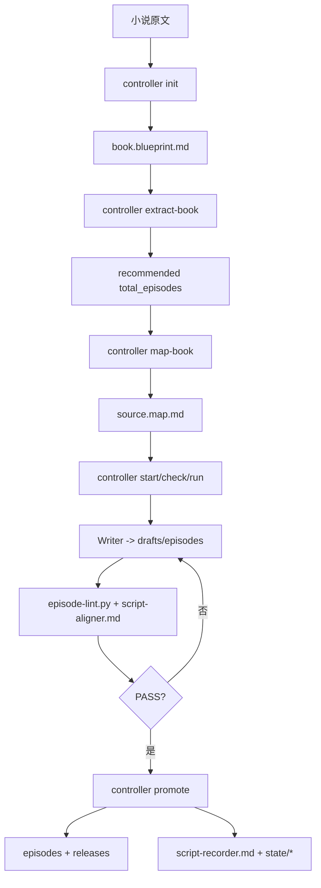

# Juben

Juben 现在只保留一套现行 workflow：`Harness V2`。
所有写作、校验、发布、记录都必须走 Harness V2 的合同层和 controller 门控，不再保留任何并行旧流程说明。

## 唯一 workflow 权威

以下路径是当前唯一 workflow source of truth：

- `harness/framework/*`
- `harness/project/*`
- `_ops/controller.py`
- `_ops/episode-lint.py`
- `_ops/script-aligner.md`
- `_ops/script-recorder.md`

根目录的 `AGENTS.md`、`OPENAI.md`、`CLAUDE.md` 只做薄路由，不定义独立流程。

## 当前结构

```text
juben/
├── AGENTS.md
├── OPENAI.md
├── CLAUDE.md
├── character.md
├── voice-anchor.md
├── drafts/episodes/
├── episodes/
├── harness/
│   ├── framework/
│   │   ├── entry.md
│   │   ├── input-contract.md
│   │   ├── write-contract.md
│   │   ├── writer-style.md
│   │   ├── verify-contract.md
│   │   ├── promote-contract.md
│   │   ├── memory-contract.md
│   │   └── regression-contract.md
│   └── project/
│       ├── run.manifest.md / run.manifest.json
│       ├── book.blueprint.md
│       ├── source.map.md / source.map.json
│       ├── batch-briefs/
│       ├── locks/
│       ├── releases/
│       ├── regressions/
│       └── state/
└── _ops/
    ├── controller.py
    ├── episode-lint.py
    ├── script-aligner.md
    ├── script-recorder.md
    └── tests
```

## Harness V2 流程



关键约束：

- Writer 只写 `drafts/episodes/`
- published episodes 只能由 `controller.py` promote
- Verify 只校验 draft lane
- Record 只写 `harness/project/state/*`
- workflow 规则只允许落在 Harness V2 合同层与 `_ops` 的执行入口
- 默认 writer 并行度是 `3`；`run.manifest.md` 的 `writer_command` 现在会显式接收 `{parallelism}` 和 `{syntax_first_flag}`，方便语法壳 smoke-first 路径先行

## Writer 规则位置

Writer 的规则现在分成两层：

- `harness/framework/write-contract.md`
  - 硬边界、对白规则、`os` 规则、原著保真边界
- `harness/framework/writer-style.md`
  - 叙事姿态、场景打法、对话打法、风格红线与警戒

不要再把 writer 规则写回根目录 workflow 文件。

## 运行入口

- 入口总线：`harness/framework/entry.md`
- 运行实例：`harness/project/run.manifest.md`
- 项目映射：`harness/project/source.map.md`
- 流程编排：`_ops/controller.py`

常用命令：

```bash
~clean
~init "novel.md" --batch-size 5 --strategy original_fidelity --intensity light --force
~extract-book
~map-book
~start batch01
~run batch01
~record batch01
python _ops/controller.py clean
python _ops/controller.py init "novel.md" --batch-size 5 --strategy original_fidelity --intensity light --force
python _ops/controller.py extract-book
python _ops/controller.py map-book
python _ops/controller.py start batch01
python _ops/controller.py start batch01 --prepare-only
python _ops/controller.py check batch01
python _ops/controller.py run batch01
python _ops/controller.py record batch01
python _ops/controller.py record-done batch01
```

- Windows 快捷入口：
  - `~start <batch>` → `python _ops/controller.py start <batch>`
  - `~run <batch>` → `python _ops/controller.py run <batch>`
  - `~clean` → `python _ops/controller.py clean`
  - `~record <batch>` → `python _ops/controller.py record <batch>`
  - 这些 wrapper 用于避开 PowerShell 自带的 `start` 冲突，并把常用操作收敛成短命令
- 新流程：
  - `init`：只建项目骨架、manifest、`book.blueprint.md` 和待生成的 `source.map.md`
  - `init` 默认不要求先给总集数；系统先锁单集 1-3 分钟动态区间，平均按 2 分钟/集
  - `extract-book`：先做全书级抽取，产出主线、角色弧光、关系变化、关键反转、结局闭环，并给出推荐总集数
  - `extract-book` 成功后，推荐总集数会默认直接写回 `run.manifest.md`
  - `map-book`：再基于全书蓝图 + 推荐总集数生成 `source.map.md`
  - `start`：最后才进入 prepare + writer stage，并在 writer 完成后停住等待 verify
- `init --episodes <n>`：可选人工覆盖；只在你明确想固定总集数时使用
- `clean`：自动备份当前 runtime 数据后，清空 draft/published/batch brief/releases/verify/retry，并重置 lock/state；保留 `source.map.md`、`run.manifest.md` 和小说源文件
- `start <batch>`：默认总入口，执行 prepare → writer stage；完成后输出下一步：`check` → aligner verify → `verify-done` → `run`
- `start <batch> --prepare-only`：只 freeze/lock 并打印上下文，保留手动写稿路径
- `run <batch>`：唯一正式发布入口，执行 lint gate → verify gate → promote → validate / review / next
- `finish <batch>`：deprecated alias；兼容旧入口，但文档与日常使用都应改成 `run <batch>`
- writer hook 配置优先级：`--writer-command` > `run.manifest.md` 的 `writer_command` > 环境变量 `JUBEN_WRITER_COMMAND`
- `writer_command` 可用占位符：`{batch_id}`、`{episodes}`、`{episodes_csv}`、`{draft_dir}`、`{project_root}`、`{python}`
- 默认 writer backend：`"{python}" _ops/run_writer.py --batch {batch_id} --episodes {episodes_csv}`，内部调用本机 `claude -p --dangerously-skip-permissions`

## 历史说明

旧版流程设计记录已经移出运行面。
如果需要查历史演进，只看 `docs/archive/README_v2_history.md`，不要把归档内容当作现行 workflow 规则重新引用。
