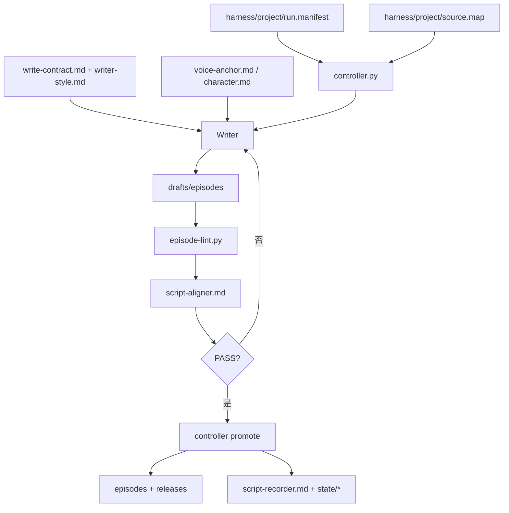

# Juben

Juben 现在只保留一套现行 workflow：`Harness V2`。
所有写作、校验、发布、记录都必须走 Harness V2 的合同层和 controller 门控，不再保留任何并行旧流程说明。

## 唯一 workflow 权威

以下路径是当前唯一 workflow source of truth：

- `harness/framework/*`
- `harness/project/*`
- `_ops/controller.py`
- `_ops/episode-lint.py`
- `_ops/script-aligner.md`
- `_ops/script-recorder.md`

根目录的 `AGENTS.md`、`OPENAI.md`、`CLAUDE.md` 只做薄路由，不定义独立流程。

## 当前结构

```text
juben/
├── AGENTS.md
├── OPENAI.md
├── CLAUDE.md
├── character.md
├── voice-anchor.md
├── drafts/episodes/
├── episodes/
├── harness/
│   ├── framework/
│   │   ├── entry.md
│   │   ├── input-contract.md
│   │   ├── write-contract.md
│   │   ├── writer-style.md
│   │   ├── verify-contract.md
│   │   ├── promote-contract.md
│   │   ├── memory-contract.md
│   │   └── regression-contract.md
│   └── project/
│       ├── run.manifest.md / run.manifest.json
│       ├── source.map.md / source.map.json
│       ├── batch-briefs/
│       ├── locks/
│       ├── releases/
│       ├── regressions/
│       └── state/
└── _ops/
    ├── controller.py
    ├── episode-lint.py
    ├── script-aligner.md
    ├── script-recorder.md
    └── tests
```

## Harness V2 流程



关键约束：

- Writer 只写 `drafts/episodes/`
- published episodes 只能由 `controller.py` promote
- Verify 只校验 draft lane
- Record 只写 `harness/project/state/*`
- workflow 规则只允许落在 Harness V2 合同层与 `_ops` 的执行入口

## Writer 规则位置

Writer 的规则现在分成两层：

- `harness/framework/write-contract.md`
  - 硬边界、对白规则、`os` 规则、原著保真边界
- `harness/framework/writer-style.md`
  - 叙事姿态、场景打法、对话打法、风格红线与警戒

不要再把 writer 规则写回根目录 workflow 文件。

## 运行入口

- 入口总线：`harness/framework/entry.md`
- 运行实例：`harness/project/run.manifest.md`
- 项目映射：`harness/project/source.map.md`
- 流程编排：`_ops/controller.py`

常用命令：

```bash
python _ops/controller.py start batch01
python _ops/controller.py check batch01
python _ops/controller.py finish batch01
python _ops/controller.py record batch01
python _ops/controller.py record-done batch01
python _ops/controller.py audit
```

## 历史说明

旧版流程设计记录已经移出运行面。
如果需要查历史演进，只看 `docs/archive/README_v2_history.md`，不要把归档内容当作现行 workflow 规则重新引用。
